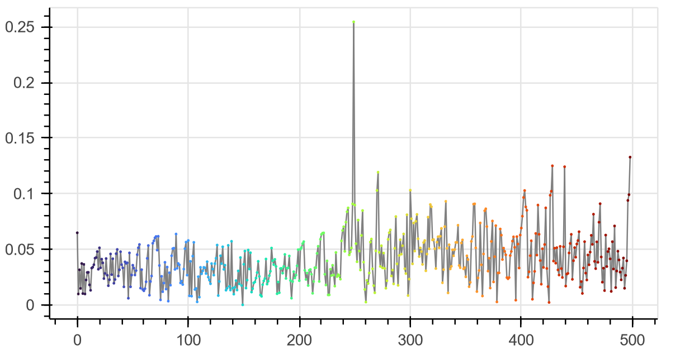
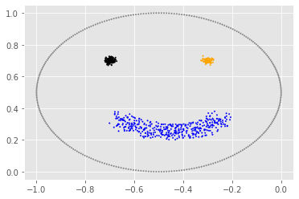

```python
from ILS_class import ILS
import unittest
```


```python
plt.style.use('ggplot')
euclidean_distance = lambda data, point: np.sqrt(np.sum(np.power(data - point, 2), axis = 1).reshape((len(data), 1)))
```


```python
def testBlobs():
        
        '''
        2D basic dataset generated by make_blobs unit test for clustering testing
        '''
    
        no_of_clusters = 4
        
        # Create the dataset
        X, y = make_blobs(n_samples = 500, centers= 4, n_features=2,random_state=185)
        
        # Run the clustering algorithm
        ils = ILS(n_clusters=4, min_cluster_size = 50, metric = 'euclidean')
        ils.fit(X)

        # Plotting
        
        ils.coloured_rmin()
        ils.plot_labels()
        ils.rainbow_rmin(notebook = True)
        
testBlobs()
```


## colouring by cluster

    

    


    


## colouring by labelling sequence
    

    


    


<div class="bk-root" id="45c7910a-957f-4373-adb8-f938c1d27866" data-root-id="18576"></div>


<div class="bk-root" id="f2ae09c5-18f1-4422-a847-c54ffb98374d" data-root-id="19247"></div>


```python
def testCircles():
        
        '''
        2D basic dataset generated by make_circles unit test for clustering testing
        '''
    
        no_of_clusters = 2
        
        # Create the dataset
        X, y = make_circles(n_samples=500, shuffle = True, noise = 0.05, factor = 0.5, random_state = 10)
        
        # Run the clustering algorithm
        ils = ILS(n_clusters=2, min_cluster_size = 50, metric = 'euclidean')
        print(type(X))
        ils.fit(X)
        
        # Plotting
        ils.coloured_rmin()
        ils.plot_labels()
        ils.rainbow_rmin(notebook = True)
        
testCircles()
```

    <class 'numpy.ndarray'>
    


    

    


    

    


    

    


    


<div class="bk-root" id="870ae2de-482f-4f90-9dbc-784e66400f0b" data-root-id="19916"></div>


<div class="bk-root" id="7bb20332-238a-4f22-a51e-b0a395433a52" data-root-id="20611"></div>


```python
def testMoons():
        
        '''
        2D basic dataset generated by make_moons unit test for clustering testing
        '''
        
        no_of_clusters = 2
        
        # Create the dataset
        X, y = make_moons(n_samples=300, shuffle = True, noise = 0.1, random_state = 10)
        
        # Run the clustering algorithm
        ils = ILS(n_clusters=2, min_cluster_size = 100, metric = 'euclidean')
        ils.fit(X)
        
        # Plotting
        ils.coloured_rmin()
        ils.plot_labels()
        ils.rainbow_rmin(notebook = True)
        
testMoons()
```


    

    


    

    


    

    


    


<div class="bk-root" id="11d2412b-67cb-4612-a0d1-bb1e92053dc7" data-root-id="21304"></div>


<div class="bk-root" id="2bdd4f98-4813-4bc9-98a7-4c979ff723c9" data-root-id="22023"></div>


```python
target = np.array(pd.read_csv(r"Testing/Artificial Data sets/target.csv", header=1))[:, :-1]
```


```python
def testArtSet_one():
    
        '''
        2D artificial dataset unit test for clustering testing
        '''
        
        no_of_clusters = 4
        
        # Run the clustering algorithm
        ils = ILS(min_cluster_size = 50)
        ils.fit(target)

        # Plotting
        ils.coloured_rmin()
        ils.plot_labels()
        ils.rainbow_rmin(notebook = True)
        
testArtSet_one()
```


    

    


    

    


    

    


    


<div class="bk-root" id="9ac2dc41-5ba0-4b4a-b604-354b61100517" data-root-id="22740"></div>


<div class="bk-root" id="cd0368a4-eed8-42c7-a002-ca271df1e06c" data-root-id="23483"></div>


```python
zelnik1 = np.array(pd.read_csv(r"Testing/Artificial Data sets/zelnik1.csv", header=1))[:, :-1]
```


```python
def testArtSet_two():    
    
        '''
        2D artificial dataset unit test for clustering testing
        '''
    
        # Run the clustering algorithm
        ils = ILS(min_cluster_size = 50)
        ils.fit(zelnik1)

        # Plotting
        ils.coloured_rmin()
        ils.plot_labels()
        ils.rainbow_rmin(notebook = True)
        
testArtSet_two()
```


    

    


    

    


    

    


    


<div class="bk-root" id="a444793b-4971-499c-84b2-c22f5aef1de4" data-root-id="24224"></div>


<div class="bk-root" id="22188471-eccc-418f-8775-bbd2b11d1c69" data-root-id="24991"></div>


```python
smile2 = np.array(pd.read_csv(r"Testing/Artificial Data sets/smile2.csv", header=1))[:, :-1]
```


```python
def testArtSet_three(): 
    
        '''
        2D artificial dataset unit test for clustering testing
        '''
    
        # Run the clustering algorithm
        ils = ILS(min_cluster_size = 50)
        ils.fit(smile2)

        # Plotting
        ils.coloured_rmin()
        ils.plot_labels()
        ils.rainbow_rmin(notebook = True)
        
testArtSet_three()
```


    

    


    

    


    

    


    


<div class="bk-root" id="e60d066f-1955-41c5-99a2-149284bd1748" data-root-id="25756"></div>


<div class="bk-root" id="f67a02ff-713c-4f67-9f0f-016ada30b734" data-root-id="26547"></div>


```python
three_d = np.array(pd.read_csv(r"Testing/Artificial Data sets/High dimensional dataset/3d-line1.csv", header=1))[:, :-1]
```


```python
def test_threeD_ArtSet(): 
    
        '''
        3D artificial dataset unit test for clustering testing
        '''
    
        # Run the clustering algorithm
        ils = ILS(min_cluster_size = 50)
        ils.fit(three_d)

        # Plotting
        ils.coloured_rmin()
        ils.plot_labels()
        ils.rainbow_rmin(notebook = True)
        
test_threeD_ArtSet()
```


    

    


    

    


    


    


<div class="bk-root" id="337cab2e-7252-4dca-be7e-d5078d0c4f14" data-root-id="27336"></div>


<div class="bk-root" id="eaa5ede4-bde9-4199-b94b-6b8897873f74" data-root-id="28151"></div>


